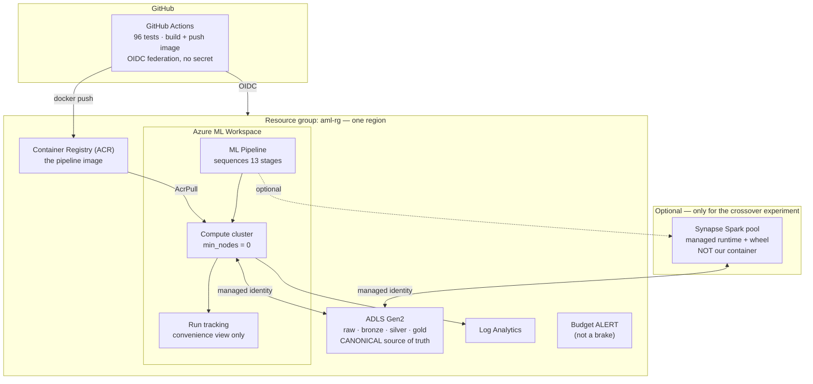
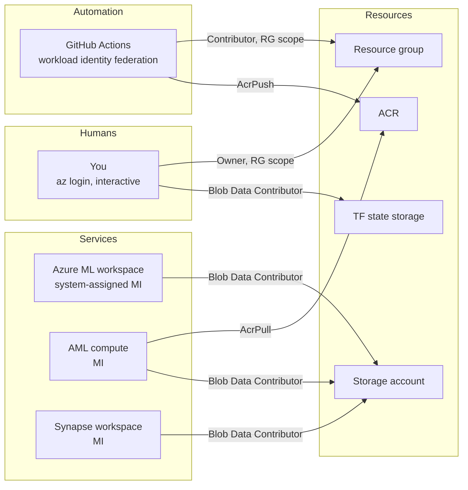

# The architecture
## Lean core, every service justified, every claim tagged

**Claim tags used throughout:**

```
✅ FACT          measured, with the measurement stated
🔬 HYPOTHESIS    plausible, not yet tested, with the test named
📋 REQUIREMENT   will be configured, and VERIFIED after provisioning
🚧 KNOWN WORK    identified, not yet done
```

---

# 1. The design

## Core — six services



## Optional — added only with a stated reason

| service | include when |
|---|---|
| **Synapse Spark** | running the DuckDB↔Spark crossover experiment (we are) |
| **Synapse Serverless SQL** | you want ad-hoc SQL over the Parquet without spinning up compute. Cheap, genuinely useful, not required |
| **Azure Functions** | **only** with a new justification — demonstrating serverless deployment and measuring p99 latency. Not as a parity-test host |

## Cut, with reasons

| service | why cut |
|---|---|
| **Data Factory** | Azure ML pipelines already sequence jobs with dependencies. A second orchestrator would need permission to invoke the first, with its own identity, retry semantics and failure surface, for zero added capability |
| **Container Apps Jobs** | it runs a container; Azure ML jobs run a container. Two services, one job |
| **Azure Functions** | its only stated justification was the parity test, and the parity test is a CI test between two Python functions. No requirement forced it |

---

# 2. Stage-to-service mapping

Every stage, where it runs, and why. **All durations and VM sizes are 🔬 HYPOTHESIS**
until the first run.

| # | stage | compute | why that size | input | output | retry | est. |
|---|---|---|---|---|---|---|---|
| 1 | `normalize` | AML `Standard_E8ds_v5`<br/>8 vCPU / 64 GB | streaming scan, I/O-bound, no blocking ops | `raw/HI-Large.csv` | `bronze/txns/` | transient ×2 | 10–30 min |
| 2 | `parse-patterns` | AML `Standard_D4ds_v5`<br/>4 vCPU / 16 GB | 13.8 MB text file | `raw/*_Patterns.txt` | `bronze/patterns/` | transient ×2 | <2 min |
| 3 | `reconcile-labels` | AML `E8ds_v5` | hash join, moderate memory | 1 + 2 | `gold/reconcile/` | transient ×2 | 10–20 min |
| 4 | `split-sweep` | AML `D4ds_v5` | rings only, ~16k rows | 2 + 3 | stdout table | transient ×2 | <2 min |
| 5 | `build-splits` | AML `E8ds_v5` | full scan + partitioned write | 2 + 3 | `gold/splits/` | **NEVER** ⚠️ | 10–20 min |
| 6 | `build-features` | AML `Standard_E32ds_v5`<br/>32 vCPU / 256 GB | ⚠️ **the risk stage** — window functions over 364M events, blocking | 3 | `silver/features/` | transient ×1 | **1–6 h** |
| 7 | `train` | AML `E16ds_v5`<br/>16 vCPU / 128 GB | ~110M × 32 matrix + working copies | 5 + 6 | `gold/models/` | resume from ckpt | 1–3 h |
| 8 | `evaluate` | AML `E8ds_v5` | scoring + ring bootstrap | 6 + 7 | `gold/eval/` | transient ×2 | 20–40 min |
| 9 | `plant-leak` ×3 | AML `E8ds_v5` | window functions, 3 variants | 3 | `gold/leak/` | transient ×2 | 15 min ea |
| 10 | `prove-leak` ×3 | AML `E16ds_v5` | 2 model fits per leak | 6 + 9 | `gold/leakproof/` | transient ×1 | 1–2 h ea |
| 11 | `make-drift` | AML `D4ds_v5` | patterns only | 2 | `gold/drift/` | transient ×2 | <2 min |
| 12 | `splice-drift` | AML `E8ds_v5` | union + rewrite | 3 + 11 | `gold/drifted/` | transient ×2 | 15 min |
| 13 | `build-features` (Spark) | **Synapse Spark pool** | the crossover comparison only | 3 | `silver/features_spark/` | transient ×1 | ? |

## ⚠️ The retry policy distinction

```
TRANSIENT failures        node preemption, storage throttling, network timeout
                          → retry is correct

CORRECTNESS failures      LeakageError, SchemaContractError, PatternParseError,
                          contract-test failure
                          → MUST NOT RETRY. Retrying a leakage assertion
                            failure would be actively harmful.
```

📋 **REQUIREMENT:** stage 5 (`build-splits`) has retry **disabled**, because its failure
mode is an assertion, not a transient fault. Other stages retry only on non-zero exit
codes classified as infrastructure errors.

🚧 **KNOWN WORK:** the CLI currently exits non-zero for *both* kinds. It needs distinct
exit codes — say `1` for transient, `2` for correctness — so the orchestrator can tell
them apart.

---

# 3. Data model and grain

v1 was ambiguous about this. Explicitly:

| layer | grain | rows at HI-Large | notes |
|---|---|---|---|
| `raw/` | one transaction | ~182,060,762 | the original CSV |
| `bronze/txns/` | one transaction | ~182,060,762 | schema-normalised, partitioned by `event_date` |
| `bronze/patterns/` | one ring · one ring-transaction · one (ring, account) | 16,467 · 137,936 · ~115k | three tables |
| `gold/reconcile/` | one transaction | ~182,060,762 | + nullable `ring_id`, `typology` |
| *(internal)* event stream | **one account-event** | **~364,121,524** | 2× transactions — sender view + receiver view. Exists only inside the feature query, never persisted |
| `silver/features/` | one transaction | ~182,060,762 | 32 features + keys + label |
| training row | one transaction | ~110M (train side) | |
| **alert / evaluation unit** | **one (account, calendar-day)** | ~? | the thing an investigator opens |

**The 364M figure is the account-event count, not a stored table.** That distinction was
unclear in v1 and matters for reasoning about memory.

---

# 4. Identity and RBAC

## The principle

```
no secret is ever created, stored, pasted or transmitted
every role assignment is scoped to the RESOURCE GROUP, never the subscription
```



## The matrix

| identity | type | scope | role | why |
|---|---|---|---|---|
| You | interactive user | resource group | Owner | bootstrap, teardown, emergency stop |
| You | interactive user | TF state storage | Storage Blob Data Contributor | read/write Terraform state |
| GitHub Actions | federated credential (OIDC) | resource group | Contributor | `terraform apply` |
| GitHub Actions | federated credential (OIDC) | ACR | AcrPush | push the image |
| AML workspace | system-assigned MI | storage account | Storage Blob Data Contributor | read/write pipeline data |
| AML compute | system-assigned MI | ACR | AcrPull | pull the image |
| AML compute | system-assigned MI | storage account | Storage Blob Data Contributor | read/write during jobs |
| Synapse workspace | system-assigned MI | storage account | Storage Blob Data Contributor | read/write for the Spark comparison |

📋 **REQUIREMENT:** verify after provisioning that **no identity holds subscription-scope
roles**, with `az role assignment list --all`.

## Terraform state — not designed in v1 at all

🚧 **KNOWN WORK:**

```
backend        Azure Storage, a SEPARATE storage account from the data
               (so `terraform destroy` on the data RG cannot delete its own state)
locking        native blob lease locking
access         your identity + the GitHub federated credential only
secrets        no secret ever enters state — every credential is federated
               or a managed identity, so there is nothing to leak into it
```

---

# 5. Threat and failure model

## What can go wrong, and what stops it

| failure | likelihood | impact | control | status |
|---|---|---|---|---|
| runaway compute cost | medium | high | `min_nodes = 0`, Spark auto-pause, budget alert, manual Cost Analysis check before/after each large run | 📋 |
| credential leak | low | severe | no secrets exist — OIDC + managed identities only | 📋 |
| over-broad permissions | medium | high | all roles RG-scoped; verified post-provision | 📋 |
| `build-features` OOM at 182M | **high** | medium | 🔬 the risk stage. Mitigations: bigger VM → day-partitioned processing → Spark | 🔬 |
| checkpoint lost on node deallocation | **high** | medium | must persist to ADLS, not node disk | 🚧 [see 04](04-storage-compatibility.md) |
| stage cache silently wrong on blob storage | **high** | **severe** | `mtime` is unreliable on object storage → wrong "cached" result | 🚧 [see 04](04-storage-compatibility.md) |
| leakage assertion retried and passed on retry | low | **severe** | retry disabled on correctness stages | 📋 |
| Terraform state corrupted / concurrent apply | medium | high | remote backend + blob lease locking | 🚧 |
| teardown leaves orphans | medium | low | orphan sweep checklist + 48h $0 verification | 📋 |
| Kaggle token leaked via VM | low | medium | env var only, never on disk; VM+disk+NIC deleted | 📋 |
| credit exhausted mid-run | medium | low | budget alerts; confirm subscription behaviour first | 🚧 |

**The two marked "severe" and 🚧 are the ones that would produce silently wrong results
rather than a visible failure** — which, given what this project is about, are the ones
that matter most.

---

# 6. Why each core service, with the requirement forcing it

### ADLS Gen2
**Requirement:** 17 GB of raw CSV plus ~10 GB of Parquet must live somewhere every
compute service can read without copying, and it must not be on your laptop (✅ FACT: you
have ~50 GB free; the file plus its derivatives would not fit).
**Rejected:** a database — the pipeline reads whole day-partitions with DuckDB; loading
182M rows into SQL first costs more and buys nothing.

### Azure Container Registry
**Requirement:** rented compute starts empty. It needs Python, DuckDB, pandas, sklearn
and our code, identically every time.
**Note:** used by Azure ML compute. **Not** by Synapse Spark — see
[Correction 2](00-corrections.md#correction-2--the-same-docker-image-runs-everywhere).

### Azure ML compute cluster
**Requirement:** the 182M feature build needs far more memory than a laptop, and the
machine must not bill when idle.
📋 **REQUIREMENT:** `min_nodes = 0`, verified after provisioning. The default is 1, which
bills continuously.

### Azure ML pipelines
**Requirement:** 13 stages with dependencies need sequencing, with per-stage retry
policies and failure propagation.
**Rejected:** Data Factory — a second orchestrator needing permission to invoke the first.

### Azure ML run tracking
**Requirement:** somewhere to see runs, metrics and artifacts without reading JSON by hand.
⚠️ **Not the source of truth** — see below.

### Log Analytics
**Requirement:** the pipeline already emits structured JSON; it should be queryable.
🚧 **KNOWN WORK:** diagnostic settings, workspace routing, retention and a correlation ID
per pipeline run all need configuring. The application needs no change; the platform does.

### Terraform + OIDC
**Requirement:** you must be able to *prove* you got back to $0. A console click-through
is neither provable nor repeatable.

### Synapse Spark (optional, and we are opting in)
**Requirement:** decision D10 promised a measured crossover. Both engines must exist.
**Gated:** no timing number is quoted until the equivalence test passes — see
[05-parity-and-benchmark.md](05-parity-and-benchmark.md).

---

# 7. Source of truth

v1 had two systems both holding models and metrics with no statement of precedence.

```
CANONICAL    ADLS gold/  +  manifest.json
             → reproducibility key, config hash, code hash, metrics, artifact sha256

CONVENIENCE  Azure ML run tracking
             → a browsable view; may be deleted without loss
```

**The link:** every Azure ML job is tagged with the `run_key` from our manifest, so a
tracked run can always be traced back to the canonical record.

📋 **REQUIREMENT:** if the two ever disagree, the manifest wins, and the disagreement is a
bug to investigate.

---

# 8. What is genuinely unchanged from the local build

```
✅ all 2,895 lines of src/aml/
✅ all 96 tests
✅ every command:  aml normalize --src ... --dest ...
✅ bronze / silver / gold layering
✅ the four split assertions
✅ manifests, caching, checkpointing (LOGIC — the storage layer needs work)
```

🚧 **What genuinely changes:** the storage layer. Documented in full in
[04-storage-compatibility.md](04-storage-compatibility.md). It is roughly a day of
careful work, not one line.
