# Azure, explained from zero
## What we're building, how it works, and why each piece exists

**Assumes you know nothing about Azure.** Every term is explained before it's used.

> ⚠️ **This file was corrected after review.** The first version contained eleven services,
> several factual errors and claims stated as facts that were guesses. See
> [00-corrections.md](00-corrections.md) for what changed and why. Claims here are tagged:
> ✅ FACT (measured) · 🔬 HYPOTHESIS (untested) · 📋 REQUIREMENT (to be verified) ·
> 🚧 KNOWN WORK (not done).

---

# Part 1 — The one idea that makes cloud make sense

Your pipeline already works on your laptop. Right now it looks like this:

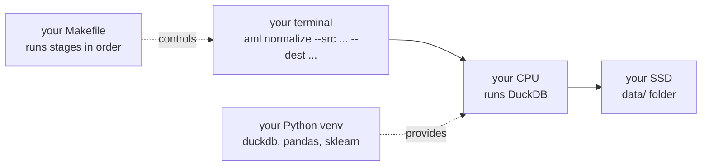

The cloud is **exactly the same shape**, with each piece rented instead of owned:

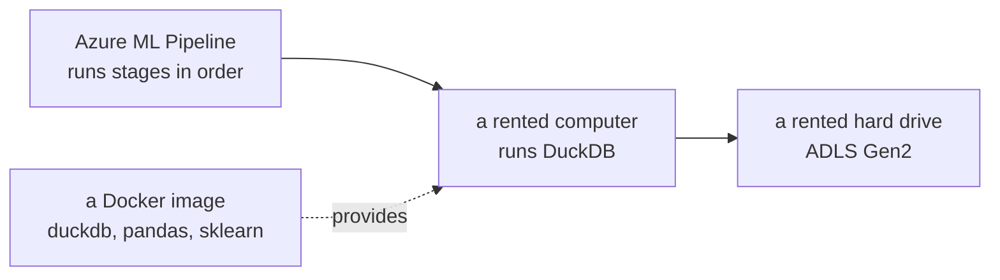

| on your laptop | in Azure | what changed |
|---|---|---|
| `data/` folder | **ADLS Gen2** (storage) | it's a shared drive on the internet |
| your CPU | **Container Apps / Azure ML** | rented by the minute, any size |
| your Python venv | **a Docker image** | frozen so every machine runs the same thing |
| your `Makefile` | **Azure ML Pipelines** | same job, with a visual run history |
| nothing | **Synapse Spark** | many computers instead of one |

> **The whole cloud move in one sentence:** the same commands, on a bigger rented
> computer, reading from a shared drive instead of your SSD.

That's why it costs us almost nothing to switch. `aml normalize --src X --dest Y` doesn't
care whether X is `data/raw` or `abfss://raw@storage/...`.

---

# Part 2 — Azure vocabulary (five words)

You need exactly five words to follow everything below.

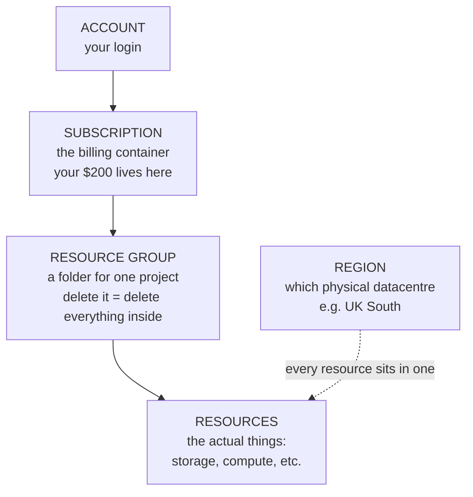

| word | what it means | why you care |
|---|---|---|
| **Subscription** | the billing boundary | your $200 credit attaches here |
| **Resource group** | a folder holding one project's stuff | **delete the folder → everything inside dies.** This is your safety net |
| **Resource** | one thing: a storage account, a cluster | what actually costs money |
| **Region** | which datacentre | keep everything in ONE region or you pay to move data between them |
| **Service principal** | a robot login for Terraform | so automation doesn't use your password |

**The most useful thing to know:** everything we create goes in **one resource group**.
If anything ever goes wrong, deleting that group removes all of it. That's the emergency
stop.

---

# Part 3 — What we're building

**Six core services.** The first version had eleven; five were cut because no requirement
forced them.

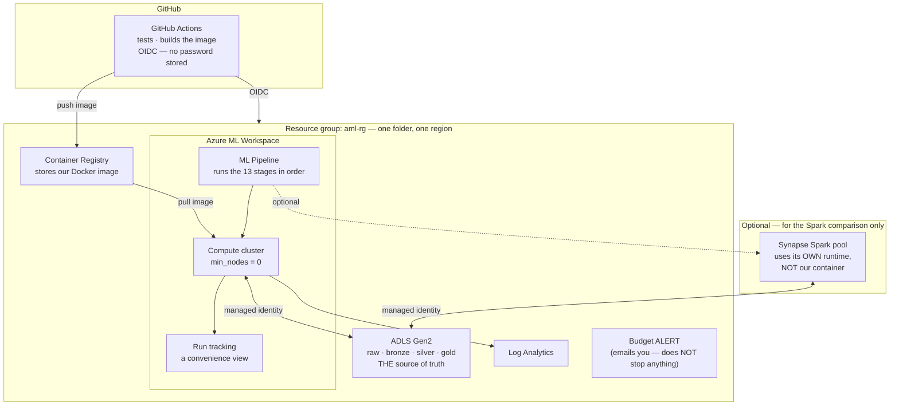

## What got cut, and why

| cut | why |
|---|---|
| **Data Factory** | I claimed 13 stages "force" it. Wrong — Azure ML pipelines already sequence jobs. A second orchestrator would need permission to invoke the first, for zero extra capability |
| **Container Apps Jobs** | it runs a container. Azure ML jobs run a container. Two services, one job |
| **Azure Functions** | its only justification was the parity test — and **the parity test doesn't need it.** It's a test between two Python functions that runs in CI in under a second |

# Part 4 — Each service, in plain terms

### ADLS Gen2 — the shared drive

**What it is:** a hard drive on the internet. Files and folders, like your `data/` folder.

**Why not just a database?** Our pipeline reads whole days of Parquet files with DuckDB.
Loading 182M rows into a database first would cost more and buy nothing.

**Cost:** ~$0.60/month for 27 GB. Basically free.

```
raw/      the original Kaggle CSVs (17 GB)
bronze/   cleaned, day-partitioned Parquet
silver/   32 features per transaction
gold/     splits, models, metrics
```

Same four layers you already have locally.

### The Docker image — your venv, frozen

**What it is:** a snapshot of a whole computer's software — Python, DuckDB, pandas,
sklearn, and our code — packed into one file.

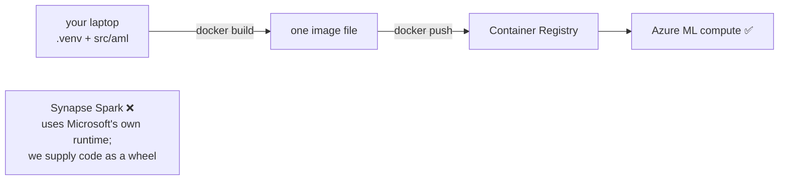

⚠️ **Correction from v1.** I originally wrote that every compute service pulls the same
image. That is **not** how Synapse Spark works — it runs Microsoft's managed Spark runtime
and takes dependencies via pool config or a custom wheel. The honest claim is that DuckDB
and Spark implement **the same versioned feature specification**, proven by an equivalence
test — which is stronger than sharing an image, because it's tested rather than assumed.

**Why it matters:** without it, every machine would need Python installed, the right
versions, the right packages. With it, every machine runs *byte-identical* software.

**Cost:** ~$5/month for the registry. Deleted at teardown.

### Container Apps Jobs — rented computer, small

**What it is:** "run this container, then shut down."

**Used for:** the fast stages — ingest, patterns, reconcile, splits. Seconds to minutes.

**Scales to zero:** between runs, nothing exists and nothing bills.

**Cost:** pennies per run.

### Azure ML jobs — rented computer, big

**What it is:** the same idea, but you can ask for a much bigger machine, and it captures
logs and output files automatically.

**Used for:** the 182M-row feature build (needs lots of memory) and model training.

**The one setting that matters:**

```
min_nodes = 0     ← the cluster shrinks to NOTHING when idle
```

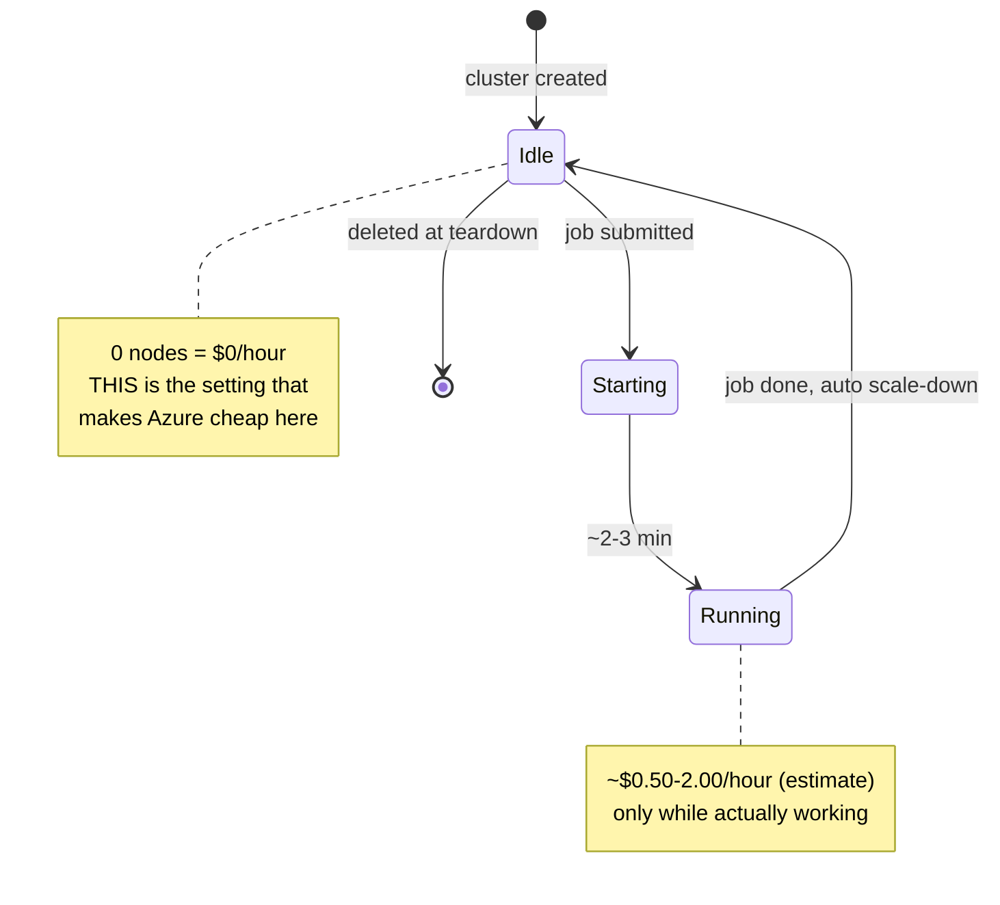

**This is the exact thing your original plan worried about with Azure.** The default is
`min_nodes = 1`, which bills 24/7.

📋 **REQUIREMENT, not yet fact:** I will set this to 0 and **verify it in the portal after
provisioning**. v1 said it was "set correctly in the Terraform" — but the Terraform didn't
exist yet, so that sentence was describing something imaginary.

### Synapse Spark — many computers instead of one

**What it is:** Spark splits work across several machines. Where DuckDB uses one big
computer, Spark uses several smaller ones.

**Why we need it:** not to run the pipeline — to **compare against** it. Decision D10
promised a measured crossover, and you need both engines to measure one.

⚠️ **But a naive comparison is worthless:** if Spark is slower, is that Spark, or is my
PySpark code worse than my SQL? You can't tell. So the comparison is **gated behind an
equivalence test** proving both engines produce identical output, before any timing number
is quoted. Same pattern as the offline/online parity test that already found two real bugs.

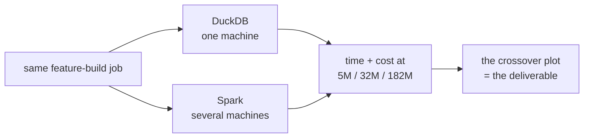

**Cost:** ~$1–3 per run, auto-pauses after 15 minutes idle.

### Azure ML Pipelines — the conductor

**What it is:** your `Makefile`, but as a service, with a picture of what ran.

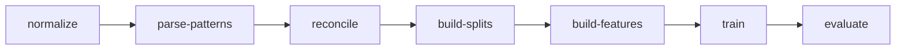

Each box is one container running one command you already run:
`aml normalize --src ... --dest ...`

**Why this and not Data Factory:** ⚠️ v1 claimed 13 dependent stages "force" Data Factory.
That was wrong — dependencies force *an* orchestrator, and Azure ML pipelines already are
one. It's inside the workspace we need anyway for compute and tracking, so using Data
Factory would mean a **second** service that must then be granted permission to invoke the
first, with its own identity, retry semantics and failure surface. Fewer moving parts.

⚠️ **On retries:** v1 said "if a stage fails, it retries." Not automatic — retry is
configuration. And more importantly, **not everything should be retried:**

```
transient   node preemption, storage throttling, network  → retry
correctness LeakageError, SchemaContractError, contract   → STOP IMMEDIATELY
```

Retrying a leakage-assertion failure would be actively harmful. Per-stage policies are in
[01-architecture.md](01-architecture.md#2-stage-to-service-mapping).

**Cost:** included in the Azure ML workspace. No separate orchestration charge.

### Synapse Serverless SQL — ask questions without a database

**What it is:** run SQL directly against Parquet files in storage. No server, no loading.

```sql
SELECT count(*) FROM OPENROWSET(BULK 'https://.../bronze/**', FORMAT='PARQUET')
```

**Cost:** ~$5 per terabyte scanned. Because we partition by day, most queries touch a
fraction of the data.

### Azure Functions — ❌ CUT

**v1 said** this was the "online half" of the parity test. That was wrong, and it's the
sharpest error the review found.

Look at what the serving code actually takes:

```python
def compute(txn, sender_history, receiver_history):
```

**It receives history as an argument. It does not fetch it.** So the parity test hands
both implementations the same history and checks they agree — it's a test between **two
Python functions**, running in CI in half a second. A deployed web endpoint adds nothing
to it.

A service whose only justification is a test that doesn't need it is a service with no
requirement. **Cut.**

*(If it comes back, it needs a genuinely different reason — demonstrating serverless
deployment with a measured p99 latency — stated as such.)*

### Terraform — infrastructure as text

**What it is:** you describe what you want in a text file; it builds it. One command up,
one command down.

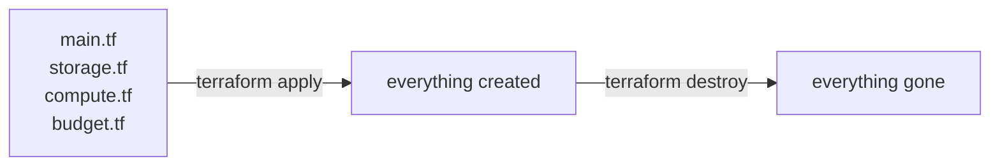

**Why it matters more than convenience:** you must be able to *prove* you got back to $0.
A console click-through can't be proven or repeated. `terraform destroy` can.

### Log Analytics and Budget — the safety rails

**Log Analytics** collects the JSON your pipeline already prints
(`{"event": "...", "rows": ..., "wall_clock_sec": ...}`) and makes it searchable.

⚠️ **Correction:** v1 said "zero code changes." The *application* needs none — but
🚧 diagnostic settings, workspace routing, permissions, retention and a correlation ID per
run all need configuring. Logs from different services don't become one coherent timeline
just because they contain JSON.

**Budget** emails you at $40, $80, $150. Free.

⚠️ **Important correction:** an Azure Budget is **an alert, not a brake.** It does not stop
anything, and billing data lags by hours — so an alert can arrive *after* the money is
spent. v1 implied it was a hard ceiling. It isn't. The real controls are `min_nodes = 0`,
Spark auto-pause, and checking Cost Analysis before and after every large run.

---

# Part 5 — What actually happens when we run it

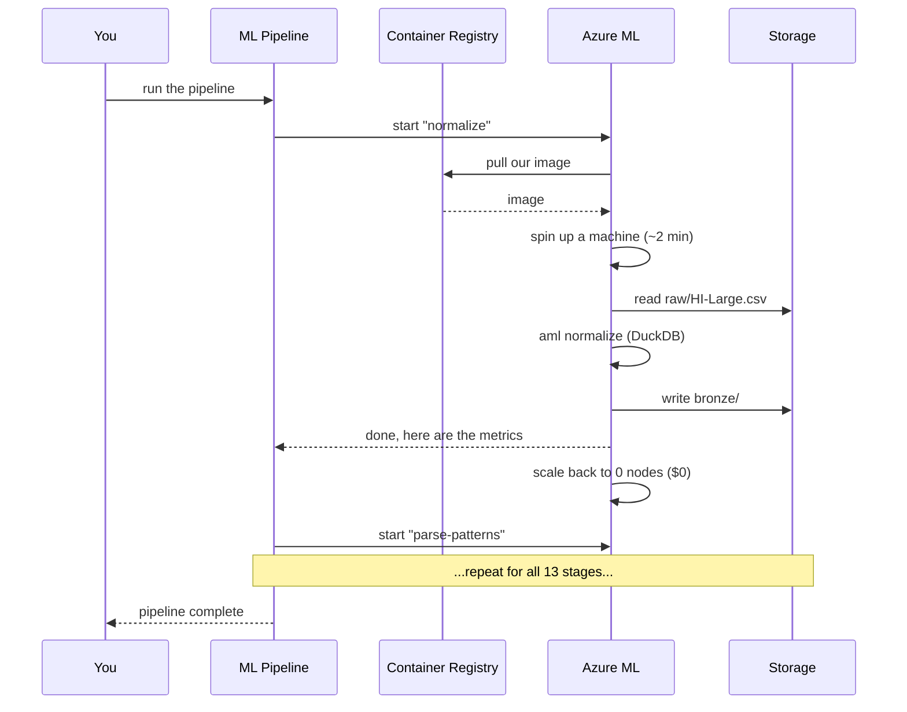

**Notice the last line of each block: the machine shuts down.** Between stages you pay
for storage only.

---

# Part 6 — The money model

The single most important thing to understand about cloud cost:

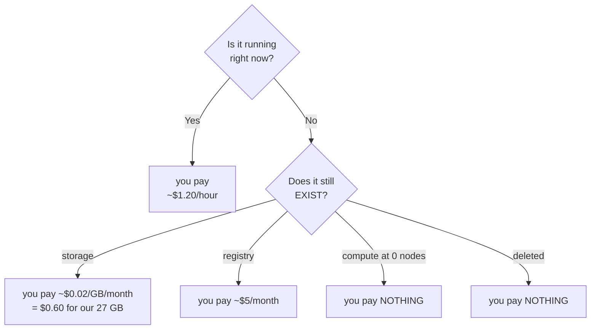

**The two things that could burn the credit while you sleep:**

```
⚠️  a Spark pool with auto-pause disabled       ~$1-3/hour, forever
⚠️  an ML cluster with min_nodes = 1            bills 24/7 even when idle
```

Both are set correctly in the Terraform. Both are worth checking by eye after the first
`apply`, because they're the only two resources here that can bill while idle.

🔬 **HYPOTHESIS: $32–93 of your $200.** Wider than v1's "$25–50", which was optimistic
and omitted Spark entirely. Full assumptions table in
[06-cost-and-teardown.md](06-cost-and-teardown.md). To be replaced by actual Azure Cost
Management figures after the first run.

---

# Part 7 — The build order

```mermaid
flowchart TD
    A["YOU: create Azure account<br/>⚠️ starts the 30-day clock"] --> B["YOU: az login,<br/>create service principal"]
    B --> C["ME: write Terraform"]
    C --> D["ME: terraform apply<br/>on an EMPTY setup"]
    D --> E["ME: terraform destroy<br/>PROVE teardown works first"]
    E --> F["ME: terraform apply again"]
    F --> G["ME: build + push Docker image"]
    G --> H["ME: 17 GB into storage<br/>~1-2 hours"]
    H --> I["ME: run the 182M pipeline<br/>2-8 hours ← the unknown"]
    I --> J["ME: DuckDB vs Spark<br/>the crossover"]
    J --> K["ME: README, cut list,<br/>teardown proof"]

    style D fill:#2d4a2d
    style E fill:#4a2d2d
```

**Why destroy is tested before anything is built:** finding out teardown is broken *after*
filling the account with data is a bad day. Prove the exit works while the room is empty.

---

# Part 8 — What we expect to break

Being honest about this up front, because it's the phase's actual content.

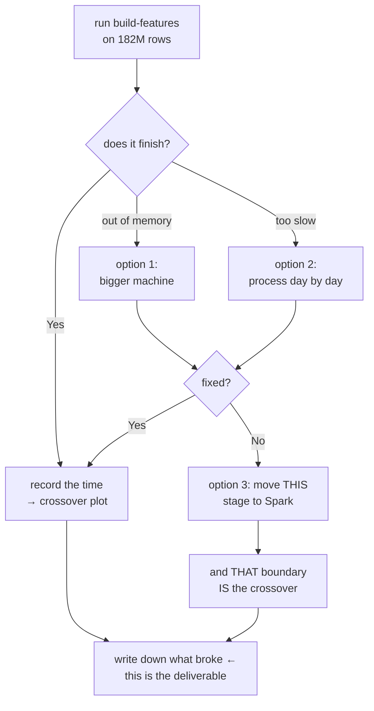

We already know where to look. From your own machine:

```
             5.08M rows    31.9M rows    throughput
normalize       1.4s          8.0s       flat ✅
build_features  6.9s        515.7s       12× WORSE per row ⚠️
```

✅ **FACT:** feature building is 12× slower per row at 6× the data.

🔬 **HYPOTHESIS:** the cause is DuckDB running out of memory and spilling to disk. v1
stated this as fact — it isn't measured. 📋 **The test:** `EXPLAIN ANALYZE` profiles, peak
memory, temp-directory growth during the run, and disk I/O counters. If throughput recovers
on a larger-memory machine, the hypothesis is supported. If not, it was wrong.

**That's not a failure — it's the finding.** *"What broke at 182 million rows?"* is the
question interviewers most want answered, and it can't be faked.

---

# Part 9 — Teardown

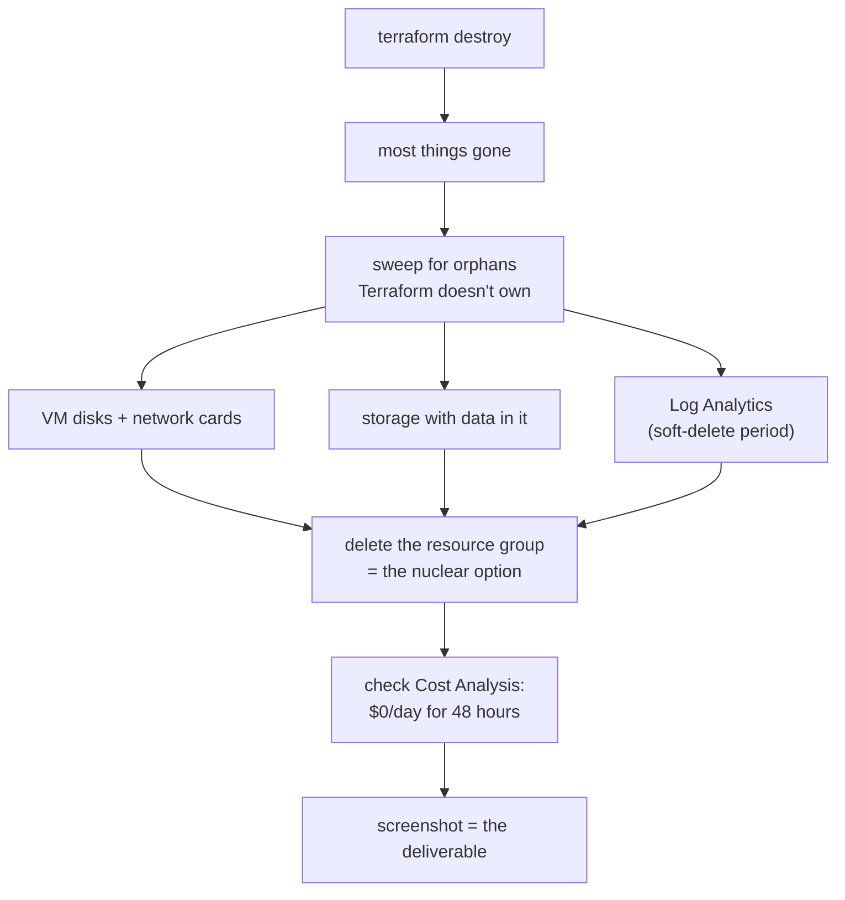

**The emergency stop:** if anything ever looks wrong, delete the resource group. Nothing
in there is precious — code, tests and local results are all on your machine and in git.

⚠️ **Correction:** v1 said "everything inside dies with it." Close, but not exact. These
can survive: role assignments scoped outside the group, soft-deleted Key Vault and Log
Analytics, the GitHub app registration, resource locks, and **Terraform state — which
lives in a separate resource group on purpose**, so destroying the data can't destroy the
record of how it was built. Full orphan checklist in
[06-cost-and-teardown.md](06-cost-and-teardown.md).

---

# Part 10 — The AWS ↔ Azure map

Worth knowing for interviews. It shows you understand the **shapes**, not one vendor's
branding.

| what it does | AWS | Azure |
|---|---|---|
| store files | S3 | ADLS Gen2 |
| SQL over files | Athena | Synapse Serverless SQL |
| run a container, scale to zero | Fargate | Container Apps Jobs |
| training job, scale to zero | SageMaker Training | Azure ML jobs |
| managed Spark | EMR Serverless | Synapse Spark pool |
| run stages in order | Step Functions | **Azure ML Pipelines** (or Data Factory) |
| tiny function | Lambda | Azure Functions |
| store Docker images | ECR | Container Registry |
| logs and metrics | CloudWatch | Log Analytics |
| identity for automation | IAM role | Service principal |

**Every AWS service in your original plan has an Azure equivalent with the same
scale-to-zero property.** That's what made the switch safe.

---

# The summary

```
what changes    Terraform (doesn't exist yet)
                one Dockerfile
                CI auth
                🚧 THE STORAGE LAYER — ~120 lines of I/O abstraction and
                   8 call-site updates. v1 said "one line." That was wrong.
                   See 04-storage-compatibility.md

what doesn't    all 2,895 lines of PIPELINE LOGIC
                all 96 tests
                every command you already run

what we gain    182 million rows instead of 32 million
                a throughput + cost table at three scales
                the point where one machine stops beating a cluster
                a PySpark implementation, proven equivalent to the SQL one

what it costs   🔬 $32-93 of your $200 (hypothesis, to be measured)
```

## The three gates before anything expensive runs

```
GATE 1   the storage abstraction ships and all 96 tests still pass LOCALLY
GATE 2   terraform destroy is proven on an EMPTY setup, before any data exists
GATE 3   the full pipeline runs on HI-Small in the cloud and matches local results

         ⚠️ NO 182M-ROW RUN UNTIL GATE 3 PASSES
```
