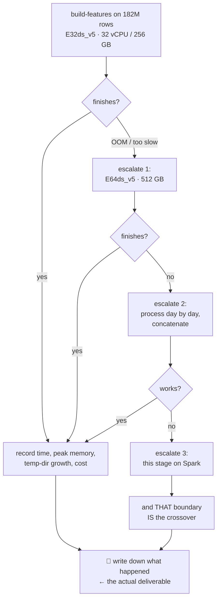

# Build order
## What you do, what I do, and the gates between

**No Azure resource is created until every contradiction in these documents is resolved
and the storage-compatibility gate is designed.** That is the point of the ordering below.

---

# ⚠️ The credential rule, first

v1 told you to create a service principal and send me its output. **That was wrong and is
withdrawn.**

```
❌ NEVER    paste a client secret, service-principal JSON, root credential or
            connection string into a chat, a file, or a repository

✅ INSTEAD  bootstrap   you run `az login` interactively; Terraform runs locally
                        under YOUR identity
            CI          GitHub Actions uses workload identity federation (OIDC).
                        No secret exists.
            services    Azure ML, compute and Synapse use MANAGED IDENTITIES.
                        No secret exists.
            scope       every role assignment is scoped to the RESOURCE GROUP
```

**Nothing is created for me. Nothing is sent to me.**

---

# STEP 0 — Decide (you)

- [ ] **Cost ceiling.** Currently: $200 total (the credit), alerts at **$40 / $80 / $150**.
      Defined once, in [06-cost-and-teardown.md](06-cost-and-teardown.md).
- [ ] **Project name.** Deferred — the repo stays `aml-platform`. Not blocking.
- [x] **Cloud: Azure.** Decided.
- [x] **Spark: Synapse, not Databricks.** Decided — cheaper, and Spark is the skill, not
      the vendor wrapper.
- [x] **Scale experiment: both.** VM-size scaling (cheap, unconfounded) *and* the
      DuckDB↔Spark crossover (gated behind an equivalence test).

---

# STEP 1 — credential hygiene (you, 15 min) — unrelated to Azure

Before starting on a new cloud, retire long-lived credentials from any old
one. Permanent access keys on a local machine are the single most common way a
personal cloud account gets compromised, and nothing in this project needs
them.

```
[ ] delete any long-lived access keys from local credential files
[ ] enable MFA on the account root/owner identity
```

Not blocking, but it should not stay indefinitely. Note that the Azure design
below deliberately needs no equivalent: `az login` is interactive, CI uses
workload identity federation (OIDC), and services use managed identities. No
client secret or connection string is ever written to a file or this repo.

---

# STEP 2 — Local work, before any Azure resource exists (me)

**This is the change from v1.** The storage layer is built and tested *locally* first.

```
[ ] src/aml/io.py                  ~120 lines — the local/blob abstraction
[ ] update 8 call sites            mkdir, write_text, open, joblib.dump
[ ] switch the cache fingerprint   mtime → ETag for blobs
[ ] persist checkpoints            to output path, not ephemeral node disk
[ ] ALL 96 EXISTING TESTS STILL PASS against local paths
[ ] docs/FEATURE_SPEC_v1.md        the engine-neutral feature specification
```

📋 **GATE 1:** the 96 tests pass unchanged. If the abstraction alters local behaviour, it
is wrong.

Full detail: [04-storage-compatibility.md](04-storage-compatibility.md).

---

# STEP 3 — Azure account (you, 15 min)

⚠️ **This starts the 30-day credit clock. Do it only when Step 2 is done.**

```bash
# 1. create the free account at azure.microsoft.com/free
# 2. CONFIRM in the portal — do not assume:
#      credit amount, currency, expiry date,
#      what happens when it is exhausted
# 3. install tooling
brew install azure-cli terraform
# 4. log in interactively
az login
# 5. tell me the SUBSCRIPTION ID and the REGION you want
az account show --query id -o tsv
```

**That is all I need.** A subscription ID is not a secret. No service principal, no
credential output.

---

# STEP 4 — Infrastructure (me)

```
infra/terraform/
  backend.tf      remote state — a SEPARATE resource group and storage account
  main.tf         providers, resource group, tags
  storage.tf      ADLS Gen2 + raw/bronze/silver/gold containers
  registry.tf     ACR
  aml.tf          Azure ML workspace + compute cluster (min_nodes = 0)
  synapse.tf      Spark pool, auto-pause enabled
  identity.tf     managed identities + RG-scoped role assignments
  monitor.tf      Log Analytics + diagnostic settings
  budget.tf       alerts at $40 / $80 / $150
  variables.tf
```

📋 **GATE 2 — teardown first:**

```
[ ] terraform apply    on an EMPTY configuration
[ ] terraform destroy  PROVE it exits clean
[ ] terraform apply    again, for real
```

> Finding out teardown is broken *after* filling the account with data is a bad day.
> Prove the exit works while the room is empty.

📋 **VERIFY AFTER PROVISIONING — do not trust the code:**

```
[ ] portal: ML compute cluster shows minimum nodes = 0
[ ] portal: Spark pool shows auto-pause ENABLED with a timeout
[ ] az role assignment list --all → no subscription-scope assignment
[ ] budget alerts exist and point at your email
```

---

# STEP 5 — The image (me)

```
[ ] Dockerfile:  python:3.12-slim + pip install -e . + ENTRYPOINT aml
[ ] GitHub Actions: OIDC → ACR, build + push on merge
[ ] verify: an Azure ML job pulls the image and runs `aml --help`
```

⚠️ **Note:** this image is used by Azure ML compute. **Synapse Spark does not use it** —
it runs Microsoft's managed runtime with our feature code supplied as a wheel.

---

# STEP 6 — ⚠️ GATE 3: the cloud-parity run on HI-Small

**The most important gate. 475 MB, minutes, cents.**

```
[ ] upload HI-Small to raw/
[ ] run the FULL pipeline against abfss:// paths
[ ] identical row counts to the local run
[ ] identical metrics to the local run
[ ] manifests written and readable from blob
[ ] a FAILED stage still writes status=failed
[ ] cache skips correctly on unchanged input
[ ] cache RE-RUNS after a blob is modified          ← the ETag test
[ ] a checkpoint survives a simulated node restart
[ ] scores round-trip and join by txn_id
```

> **📋 NO 182M-ROW RUN UNTIL THIS PASSES.** Debugging a storage bug inside a six-hour job
> is the expensive way to find it.

---

# STEP 7 — Getting 17 GB into storage (me)

**HI-Large never touches your laptop** — ✅ FACT: ~50 GB free, and the file plus its
derivatives would not fit.

```
[ ] temporary VM in the same region, adequate temp disk
[ ] Kaggle token supplied as an ENV VAR ONLY, never written to disk
[ ] download → verify sha256 → record it in a manifest
[ ] azcopy into raw/ using managed identity
[ ] DELETE the VM, its OS disk, AND its network interface
[ ] confirm CDLA-Sharing-1.0 permits storing it in a private account
    (it does; share-alike applies only to redistribution)
```

🔬 1–2 hours wall clock, ~$1.

---

# STEP 8 — The scale run (me to launch, hours to run)

```
[ ] normalize · parse-patterns · reconcile
[ ] split-sweep → pick the cut FROM DATA (🔬 expect ~40%)
[ ] build-splits + the four assertions
[ ] build-features        ⚠️ THE RISK STAGE
[ ] train · evaluate
```

## ⚠️ The risk stage, and the escalation path



✅ **FACT:** throughput fell 739K → 62K rows/sec from 5M to 32M (12× worse per row).
🔬 **HYPOTHESIS:** memory pressure and spilling.
📋 **TEST:** `EXPLAIN ANALYZE` profiles, peak RSS, temp-dir growth, disk I/O counters. **If
throughput recovers on a larger-memory VM, the hypothesis is supported. If not, v1's
confident "that's DuckDB spilling" was wrong** and we say so.

---

# STEP 9 — The two scale experiments (me)

## Option B — VM scaling (cheap, unconfounded)

```
[ ] same code, E8 → E16 → E32 → E64
[ ] record time, peak memory, spill, cost at each
[ ] plot: where does adding memory stop helping?
```

## Option A — DuckDB vs Spark (gated)

```
[ ] docs/FEATURE_SPEC_v1.md          done in Step 2
[ ] features/build_spark.py          the PySpark implementation
[ ] tests/engine_parity/             ⚠️ MUST PASS BEFORE ANY TIMING IS QUOTED
[ ] benchmark: 3 repeats × 3 scales × 2 engines
[ ] cold and warm labelled separately; Spark startup reported, not hidden
[ ] metered cost from Cost Management, not estimated
```

Protocol: [05-parity-and-benchmark.md](05-parity-and-benchmark.md).

---

# STEP 10 — Publish and tear down (me)

```
[ ] throughput + cost table, all three scales, both engines
[ ] the crossover plot — or an honest "no crossover in this range"
[ ] "what broke at 182M rows" written up
[ ] README with the cut list
[ ] one ADR per decision, including D2 reversed, D6 reversed, D11 cut
[ ] terraform destroy + the orphan sweep
[ ] Cost Analysis showing $0/day for 48 hours — screenshot
```

---

# The gates, in one view

```mermaid
flowchart TD
    S2["STEP 2: local storage layer"] --> G1{"GATE 1<br/>96 tests still pass<br/>against LOCAL paths"}
    G1 -->|pass| S3["STEP 3: Azure account<br/>⚠️ credit clock starts"]
    G1 -->|fail| S2
    S3 --> S4["STEP 4: Terraform"]
    S4 --> G2{"GATE 2<br/>destroy proven<br/>on an EMPTY setup"}
    G2 -->|pass| S5["STEP 5: image"]
    G2 -->|fail| S4
    S5 --> S6["STEP 6: HI-Small<br/>in the cloud"]
    S6 --> G3{"GATE 3<br/>cloud results match<br/>local results"}
    G3 -->|pass| S7["STEP 7-9: 17 GB,<br/>scale run, experiments"]
    G3 -->|fail| S2
    S7 --> S10["STEP 10: publish + teardown"]

    style G1 fill:#2d4a2d
    style G2 fill:#4a2d2d
    style G3 fill:#2d3a5a
```



**Three gates, and each one fails backwards to real work rather than forwards into an
expensive run.**

---

# What I need from you, in one list

```
[ ] confirm the cost ceiling and alert thresholds ($200 / $40 / $80 / $150)
[ ] your preferred Azure region
[ ] subscription ID — AFTER Step 2 is done, so the credit clock doesn't burn
[ ] (whenever) retire long-lived keys on any other cloud account
```

**Not needed, ever:** a service principal, a client secret, or any credential output.
