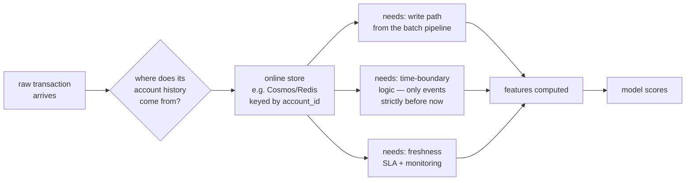

# Parity contract and benchmark protocol
## What the tests actually assert, and how the Spark comparison is made honest

Two things v1 hand-waved: what the offline/online parity test really compares, and how a
DuckDB-vs-Spark comparison avoids being confounded. Both are specified here.

---

# Part 1 — The offline/online parity contract

## What v1 got wrong

v1 claimed the parity test justified deploying an Azure Function as "the online half."
Look at the signature:

```python
def compute(txn, sender_history, receiver_history):
```

**It receives history as an argument. It does not fetch it.** The test hands both
implementations the same history and checks they agree. That is a test between **two
Python functions**, running in CI in under a second. A deployed endpoint adds nothing.

The Function is therefore **cut**, and the parity test is specified honestly below.

## What the parity test DOES assert

```
GIVEN   one transaction, and that transaction's account history,
        supplied identically to both implementations

THEN    features/build.py  (DuckDB SQL, batch, 182M rows at once)
        features/online.py (pure Python, one row at a time)

        produce identical values for all 32 features
```

**Tolerance:**

| feature type | tolerance | why |
|---|---|---|
| counts, flags, codes | **exact** | integers; any difference is a bug |
| amounts, ratios, seconds | `rtol=1e-9, atol=1e-6` | SQL and numpy sum in different orders, and floating-point addition is not associative |
| nulls | **exact** | NULL vs 0 must match — F12 (author's working notes, not part of this repository) |

**The fixture deliberately contains** same-minute ties, self-transfers, receive-only mule
accounts, cold-start rows with no history, and brand-new counterparties — with a test
asserting the fixture *contains* them, so passing means something.

✅ **FACT:** this test found two real bugs on its first run — `log()` base-10 vs natural
log, and `sum()` over an empty window returning NULL.

## What the parity test does NOT assert

Being explicit, because v1 overclaimed:

```
❌ that history RETRIEVAL is correct — history is an input, not fetched
❌ that a deployed endpoint returns the same answer as CI
❌ latency, throughput, or concurrency behaviour
❌ point-in-time correctness of a real online store
❌ anything about model scoring under production load
```

## And it does not replace a feature store

v1 said the test *"removes the same risk for free."* Too broad.

| capability | feature store | our parity test |
|---|---|---|
| prevents train/serve skew | ✅ | ✅ |
| versioned feature reuse across teams | ✅ | ❌ |
| point-in-time historical retrieval | ✅ | ❌ |
| online state / low-latency lookup | ✅ | ❌ |
| freshness monitoring | ✅ | ❌ |

**Honest claim:** the parity test removes **the train/serve skew risk**, which is the one
that matters for a batch project with no live traffic. We don't need the rest, and we
should say that rather than implying equivalence.

## What a real serving endpoint would need

Documented so the gap is visible rather than accidental. **Not in scope for v1.**



**None of that exists**, and building it turns a batch project into a streaming one.
Decision: out of scope, stated in the README rather than hidden.

**If the Function returns**, its justification must be *"demonstrating serverless
deployment with a measured p99 latency on precomputed feature vectors"* — which tests
**model-scoring parity only**, and must be labelled as such.

---

# Part 2 — The DuckDB ↔ Spark benchmark protocol

## The problem with a naive comparison

```
if Spark is slower...  is that Spark?
                       or is my PySpark worse than my SQL?
                       you cannot tell → the measurement is worthless
```

## The fix — a pattern this project already owns

```
features/build.py       (DuckDB SQL)   ┐
                                       ├→ tests/engine_parity/  proves they agree
features/build_spark.py (PySpark)      ┘
```

**Identical structure to the offline/online parity test**, which already found two real
bugs. Same machinery, new pair.

**⚠️ Note:** Synapse Spark runs Microsoft's managed runtime with dependencies supplied via
pool configuration, `requirements.txt` or custom wheels — **not our ACR container**. So
what is shared is the *specification*, not the image.

## Step 1 — A versioned, engine-neutral feature specification

🚧 **KNOWN WORK:** `docs/FEATURE_SPEC_v1.md` — the 32 features written down independently
of any engine:

```
for each feature:
    name, dtype
    window bounds, INCLUSIVE OR EXCLUSIVE at each end
    null semantics when the window is empty
    tie-breaking rule at equal timestamps
    the exact arithmetic (ln vs log10, population vs sample stddev)
```

**Why this is not bureaucracy:** two of the three bugs found so far were *specification*
ambiguities, not coding errors — `log` base and empty-window `sum`. A written spec is
what makes "the implementations disagree" a resolvable question instead of an argument.

## Step 2 — The PySpark implementation

Spark has window functions, so it is a translation. The parts that will bite:

| risk | why |
|---|---|
| `rangeBetween` semantics | Spark's range frames use numeric offsets; time windows need a cast to epoch seconds |
| the 1-minute boundary | must exclude same-minute siblings exactly as DuckDB does |
| empty-window `sum` | Spark also returns null — must `coalesce` identically |
| `stddev_pop` vs `stddev_samp` | divides by n vs n−1. Must match |
| null propagation in division | must match `nullif` behaviour |

## Step 3 — The equivalence gate ⚠️ blocking

🚧 **KNOWN WORK:** `tests/engine_parity/test_duckdb_vs_spark.py`

```
[ ] same input (HI-Small, 5.08M rows) through both engines
[ ] identical row count
[ ] identical schema — names, order, dtypes
[ ] every column compared:
        integers exact · floats rtol 1e-9 · nulls exact
[ ] null COUNTS match per column
[ ] a report of the worst per-column deviation
```

> **📋 REQUIREMENT: no timing number is quoted until this test passes.** If the engines
> disagree, the benchmark is comparing two different computations.

## Step 4 — The benchmark protocol

Everything recorded, so the comparison is reproducible and attackable.

### Runs

```
engines      DuckDB (Azure ML compute)  ·  Spark (Synapse pool)
scales       5.08M · 31.9M · 182M rows
repeats      3 per (engine, scale)  → report median, min, max
cold/warm    labelled SEPARATELY, never averaged together
                cold = first run after cluster/pool start
                warm = subsequent runs, caches populated
```

### Recorded per run

```
wall clock                          end to end
compute time                        excluding startup
STARTUP TIME                        reported separately, NOT hidden
                                    ⚠️ Spark pools take minutes to start; excluding
                                    that would flatter Spark, including it silently
                                    would flatter DuckDB. Report both.
peak memory                         DuckDB: RSS · Spark: executor peak
spill / shuffle                     DuckDB: temp dir growth · Spark: shuffle metrics
rows/sec                            derived
VM SKU / node count / node size
software versions                   DuckDB, Spark, Python, runtime
METERED COST                        from Azure Cost Management, NOT estimated
```

### The output

```
time
 ^                                    ╱ DuckDB (single node)
 │                                  ╱
 │                       ╱─────╳──────   <- the crossover, IF one exists
 │                 ╱────╱      │
 │  ────────────────             Spark
 └──────────────────────────────┴────────> rows
     5M          32M                182M
```

**And the honest possibility:** there may be **no crossover in this range**. DuckDB on a
256 GB machine may win at 182M rows. That is a perfectly good result and must be
reportable — the deliverable is *the measurement*, not a predetermined conclusion.

## Step 5 — The claim we are allowed to make

**Only after all of the above:**

> *"I implemented the same versioned feature specification in DuckDB SQL and PySpark,
> proved they produce identical output to 1e-9 on every row, then benchmarked both at
> three scales with startup time and metered cost reported separately. Here is where each
> wins."*

**Not allowed** until the gate passes:

```
❌ "Spark was slower"                    (which Spark? whose code?)
❌ "DuckDB beats Spark up to N rows"     (confounded)
❌ any timing from a run where the engines disagreed
```

---

# Part 3 — The Option B experiment, which runs regardless

Independent of Spark, and cheaper: **the same DuckDB code on increasing machine sizes.**

```
Standard_E8ds_v5     8 vCPU / 64 GB    → finishes? how long? peak memory?
Standard_E16ds_v5   16 vCPU / 128 GB   → ?
Standard_E32ds_v5   32 vCPU / 256 GB   → ?
Standard_E64ds_v5   64 vCPU / 512 GB   → ?
```

**Answers a different and arguably more useful question:** *what actually breaks at 182
million rows, and how much machine does it take?*

Only one variable changes, so the result is unconfounded by construction.

## And it tests the outstanding hypothesis

```
✅ FACT        feature-build throughput fell 739K → 62K rows/sec from 5M to 32M
               (12× worse per row; n log n sorting alone predicts ~8×)
🔬 HYPOTHESIS  the cause is memory pressure and spilling to temp storage
📋 THE TEST    DuckDB EXPLAIN ANALYZE profiles · peak RSS · temp-directory growth
               during the run · disk I/O counters
               → if throughput recovers on a larger-memory VM, the hypothesis
                 is supported. If it does not, the cause is something else
                 and v1's confident "that's DuckDB spilling to disk" was wrong.
```

**Both experiments run.** Option B is cheap and unconfounded; Option A gives the
crossover and the Spark implementation. Neither replaces the other.
