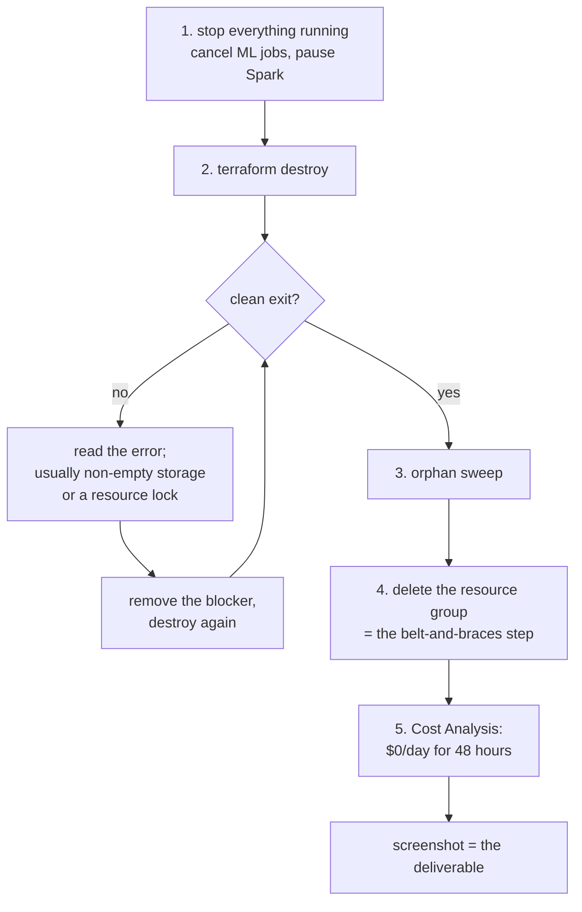

# Cost and teardown
## Assumptions stated, and what the budget actually does

**Currency: USD throughout.** v1 mixed £ and $ and gave two different figures. Fixed.

---

# 1. ⚠️ The Budget is an ALERT, not a brake

v1 implied the Azure Budget enforced a ceiling. **It does not.**

```
what it does      sends an email when accrued spend crosses a threshold
what it does NOT  stop any resource, cancel any job, or block any spend
lag               billing data can be hours behind actual usage
```

**So an alert can arrive after the money is spent.**

## The controls that actually work

```
1. min_nodes = 0            no idle compute cost         📋 verify post-provision
2. Spark auto-pause         no idle pool cost            📋 verify post-provision
3. manual Cost Analysis     check BEFORE and AFTER every large run
4. small-scale first        debug on 5M, never on 182M
5. the stage cache          a rerun recomputes only what changed
6. the emergency stop       delete the resource group
```

**Control 3 is the real one.** It's a human habit, not automation.

## If you want a genuine kill switch

🚧 **KNOWN WORK, not built:** budget alert → action group → runbook that cancels running
Azure ML jobs and pauses the Spark pool. Worth it only if runs will be launched
unattended. **Acknowledge the billing lag: it cannot prevent overspend, only shorten it.**

---

# 2. Cost assumptions — 🔬 PRE-RUN HYPOTHESIS

Every figure below is an estimate. **To be replaced by Azure Cost Management actuals
after the first run.**

## Stated assumptions

| assumption | value | why it could be wrong |
|---|---|---|
| region | UK South *(TBC)* | prices vary by region |
| currency | USD | your subscription may bill in GBP |
| credit | $200 / 30 days | ⚠️ **confirm in your actual subscription** — amount, currency, eligibility and expiry all vary |
| storage | 27 GB (17 raw + ~10 Parquet) | features may be larger than expected |
| ML compute SKU | `E8ds_v5` → `E32ds_v5` | quota may not permit the larger sizes |
| feature-build runtime | 1–6 hours | **the biggest unknown** |
| reruns during development | ~10 | debugging could double this |
| Spark pool minimum | 3 nodes *(TBC)* | Synapse has a minimum node count; verify |
| Spark startup | ~3–5 min per run | billed |
| log ingestion | within free tier | high verbosity could exceed it |

## The estimate

| item | rate *(est.)* | usage *(est.)* | cost *(est.)* |
|---|---|---|---|
| ADLS Gen2, 27 GB | ~$0.02/GB/mo | 1 month | **$0.60** |
| Azure ML compute | ~$0.50–2.00/hr | ~20 h total | **$10–40** |
| Synapse Spark | ~$1–3/run | ~15 runs | **$15–45** |
| Container Registry (Basic) | ~$5/mo | 1 month | **$5** |
| Serverless SQL *(optional)* | ~$5/TB scanned | a few queries | **<$1** |
| Log Analytics | free tier | | **$0** |
| Temp VM for upload | ~$0.10/hr + disk | ~2 h | **<$1** |
| **TOTAL** | | | **$32–93** |

```
🔬 hypothesis range     $32 – $93
   credit                    $200
   headroom                  ample even at the top of the range
```

**Wider than v1's "$25–50" because v1 was optimistic and omitted Spark.**

## Where it could actually go wrong

```
⚠️  feature build takes 6h instead of 1h, on a big VM, run 5 times
    → 30 h × $2/hr = $60 from one stage alone
⚠️  Spark pool minimum node count higher than assumed
⚠️  a forgotten pool with auto-pause misconfigured
    → $1–3/hour indefinitely — the single biggest risk
```

📋 **REQUIREMENT:** after the first `terraform apply`, manually verify in the portal that
`min_nodes = 0` and Spark auto-pause are actually set. **Do not trust the code without
looking.**

---

# 3. Per-service idle behaviour

v1 said "all compute scales to zero." Imprecise — three different mechanisms and two
things that never scale to zero.

| service | idle behaviour | idle cost |
|---|---|---|
| Azure ML compute | deallocates nodes at `min_nodes = 0` | **$0** |
| Synapse Spark pool | auto-pauses after idle timeout | **$0** compute |
| Synapse workspace | exists | $0 (control plane) |
| ADLS Gen2 | always exists | **~$0.60/mo** |
| Container Registry | always exists | **~$5/mo** |
| Azure ML workspace | exists; has dependencies (Key Vault, App Insights, a storage account) | small but **not zero** |
| Log Analytics | retains data | free tier, then per GB |

⚠️ **An Azure ML workspace creates dependent resources** — Key Vault, Application
Insights, and its own storage account. They are small, they are easy to forget at
teardown, and they are on the orphan checklist below.

---

# 4. Teardown

## Order matters



## The checklist

```
BEFORE destroy
[ ] all Azure ML jobs cancelled or complete
[ ] Synapse Spark pool paused
[ ] no pipeline runs in progress

TERRAFORM
[ ] terraform destroy exits clean
[ ] terraform state list  → empty

ORPHAN SWEEP — things Terraform may not own
[ ] Azure ML workspace dependencies: Key Vault, App Insights, its storage account
[ ] Key Vault is SOFT-DELETED by default → purge explicitly
[ ] the temporary upload VM: its OS disk AND its network interface
[ ] role assignments created outside the resource group
[ ] the GitHub federated credential (app registration)
[ ] diagnostic settings pointing at deleted resources
[ ] Log Analytics workspace (has its own soft-delete period)
[ ] resource locks that would block deletion

THE BELT-AND-BRACES STEP
[ ] delete the resource group itself

⚠️ DO NOT DELETE
[ ] the Terraform state storage account — it lives in a SEPARATE resource group
    precisely so destroying the data RG cannot destroy its own state

VERIFY
[ ] Cost Analysis shows $0/day for 48 consecutive hours
[ ] screenshot it — "teardown verified at $0 for 48h" is on the definition of done
```

## ⚠️ "Delete the resource group and everything dies" — the honest version

**True enough for an emergency stop. Not exact.**

```
survives    role assignments scoped outside the group
            soft-deleted Key Vault (recoverable for 90 days by default)
            soft-deleted Log Analytics
            Terraform state (deliberately, in another group)
            the app registration / federated credential
            anything with a resource lock
```

**Use it as the emergency stop it is** — then run the sweep.

---

# 5. If something goes wrong

**Budget alert fires:**

```
1. Azure Portal → Cost Analysis, filter by the project tag (everything is tagged)
2. sort by cost — it will be compute
3. it will be the Spark pool or the ML cluster
4. pause / scale to 0 / cancel the job
5. if unclear: delete the resource group. Nothing there is precious —
   code, tests and local results are on your machine and in git
```

**Credit exhausted:**

🚧 **Confirm the behaviour in your subscription before relying on it.** It may suspend
resources, or convert to pay-as-you-go if a card is attached. v1 asserted "everything
stops"; that is not universally true and should not be treated as a control.

---

# 6. Cost discipline already built into the code

Three things from earlier phases that now save money rather than minutes:

```
stage caching      a rerun costs only what actually changed
                   ⚠️ needs the ETag fix first — see 04-storage-compatibility.md
GBDT checkpoints   a crash at round 280 of 300 resumes at 250
                   ⚠️ needs persisting to ADLS first — same file
--sample           validate the whole path on 1% of rows in seconds
```

Two of the three need cloud work before they function. **That work is a cost control, not
just correctness.**

---

# 7. The one rule

> **Debug on 5 million rows. Never on 182 million.**

The pipeline already works at 32M locally. The cloud run should be the first time you
expect success, not the first time you look for bugs.

Everything expensive is the 182M runs. Everything else is rounding error.
