# Azure, explained from zero
## What we're building, how it works, and why each piece exists

**Assumes you know nothing about Azure.** Every term is explained before it's used.

---

# Part 1 — The one idea that makes cloud make sense

Your pipeline already works on your laptop. Right now it looks like this:

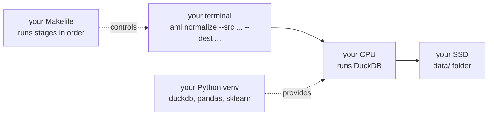

The cloud is **exactly the same shape**, with each piece rented instead of owned:

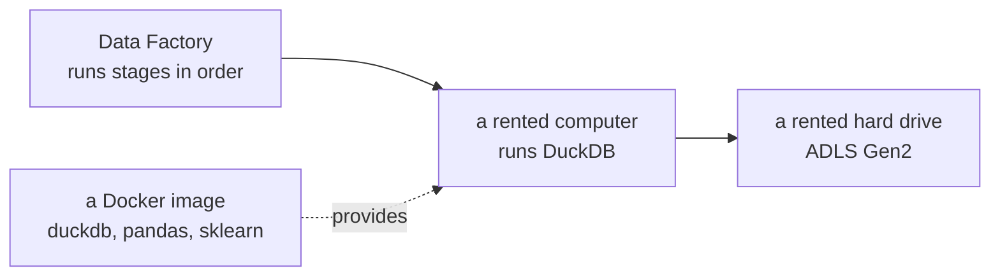

| on your laptop | in Azure | what changed |
|---|---|---|
| `data/` folder | **ADLS Gen2** (storage) | it's a shared drive on the internet |
| your CPU | **Container Apps / Azure ML** | rented by the minute, any size |
| your Python venv | **a Docker image** | frozen so every machine runs the same thing |
| your `Makefile` | **Data Factory** | same job, with a visual run history |
| nothing | **Synapse Spark** | many computers instead of one |

> **The whole cloud move in one sentence:** the same commands, on a bigger rented
> computer, reading from a shared drive instead of your SSD.

That's why it costs us almost nothing to switch. `aml normalize --src X --dest Y` doesn't
care whether X is `data/raw` or `abfss://raw@storage/...`.

---

# Part 2 — Azure vocabulary (five words)

You need exactly five words to follow everything below.

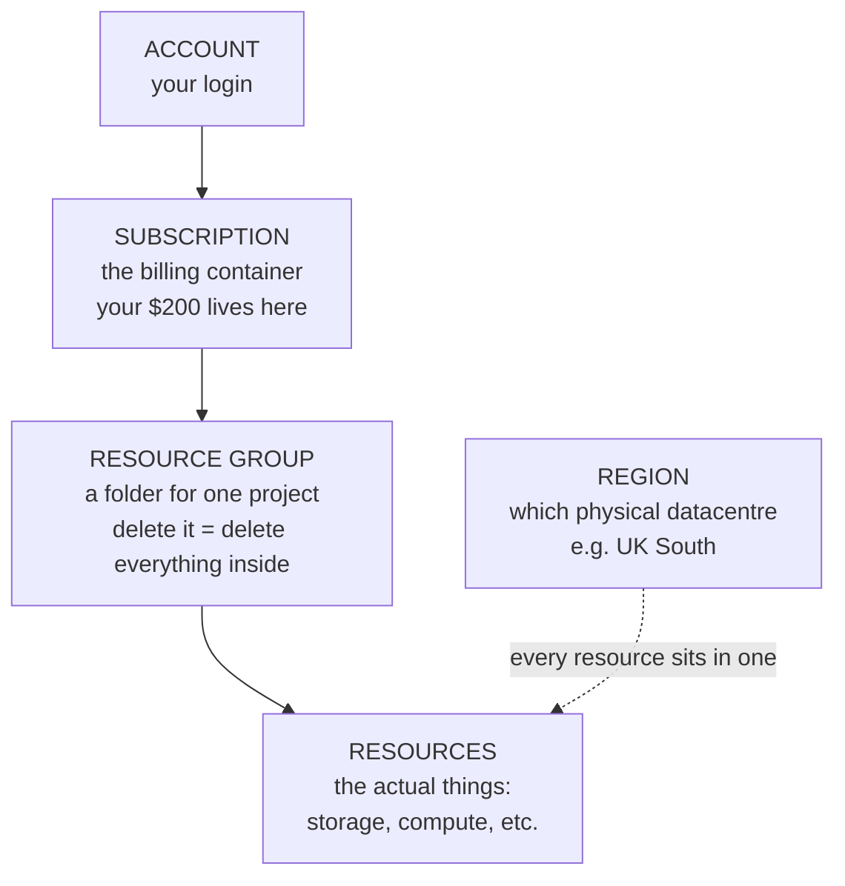

| word | what it means | why you care |
|---|---|---|
| **Subscription** | the billing boundary | your $200 credit attaches here |
| **Resource group** | a folder holding one project's stuff | **delete the folder → everything inside dies.** This is your safety net |
| **Resource** | one thing: a storage account, a cluster | what actually costs money |
| **Region** | which datacentre | keep everything in ONE region or you pay to move data between them |
| **Service principal** | a robot login for Terraform | so automation doesn't use your password |

**The most useful thing to know:** everything we create goes in **one resource group**.
If anything ever goes wrong, deleting that group removes all of it. That's the emergency
stop.

---

# Part 3 — What we're building

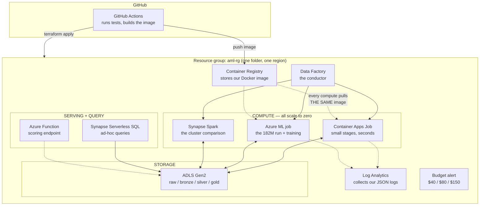

**The thing to notice:** one Docker image feeds every compute service. That's what makes
"the same code runs everywhere" literally true rather than a claim.

---

# Part 4 — Each service, in plain terms

### ADLS Gen2 — the shared drive

**What it is:** a hard drive on the internet. Files and folders, like your `data/` folder.

**Why not just a database?** Our pipeline reads whole days of Parquet files with DuckDB.
Loading 182M rows into a database first would cost more and buy nothing.

**Cost:** ~$0.60/month for 27 GB. Basically free.

```
raw/      the original Kaggle CSVs (17 GB)
bronze/   cleaned, day-partitioned Parquet
silver/   32 features per transaction
gold/     splits, models, metrics
```

Same four layers you already have locally.

### The Docker image — your venv, frozen

**What it is:** a snapshot of a whole computer's software — Python, DuckDB, pandas,
sklearn, and our code — packed into one file.

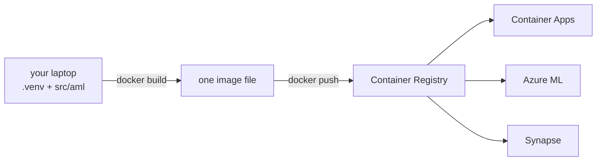

**Why it matters:** without it, every machine would need Python installed, the right
versions, the right packages. With it, every machine runs *byte-identical* software.

**Cost:** ~$5/month for the registry. Deleted at teardown.

### Container Apps Jobs — rented computer, small

**What it is:** "run this container, then shut down."

**Used for:** the fast stages — ingest, patterns, reconcile, splits. Seconds to minutes.

**Scales to zero:** between runs, nothing exists and nothing bills.

**Cost:** pennies per run.

### Azure ML jobs — rented computer, big

**What it is:** the same idea, but you can ask for a much bigger machine, and it captures
logs and output files automatically.

**Used for:** the 182M-row feature build (needs lots of memory) and model training.

**The one setting that matters:**

```
min_nodes = 0     ← the cluster shrinks to NOTHING when idle
```

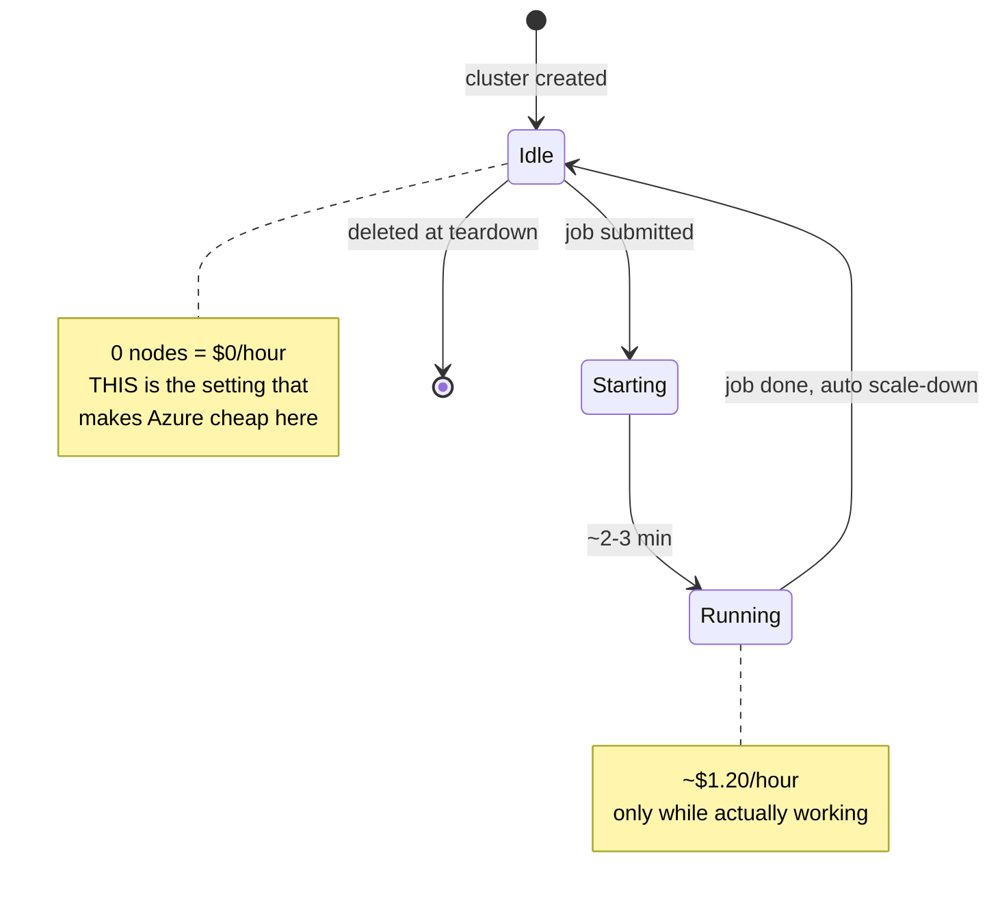

**This is the exact thing your original plan worried about with Azure.** The default is
`min_nodes = 1`, which bills 24/7. We set it to 0. It's one line of Terraform.

### Synapse Spark — many computers instead of one

**What it is:** Spark splits work across several machines. Where DuckDB uses one big
computer, Spark uses several smaller ones.

**Why we need it:** not to run the pipeline — to **compare against** the pipeline. Your
project promises to measure *where a single machine stops winning*. You need both engines
to measure that.

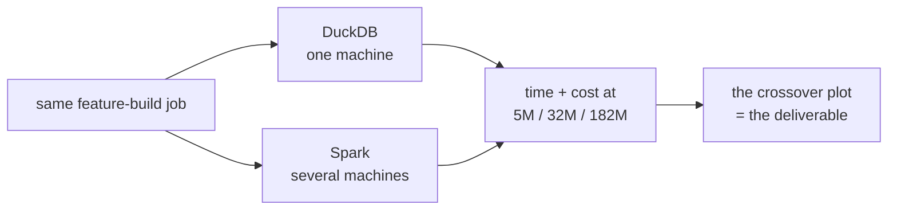

**Cost:** ~$1–3 per run, auto-pauses after 15 minutes idle.

### Data Factory — the conductor

**What it is:** your `Makefile`, but as a service, with a picture of what ran.

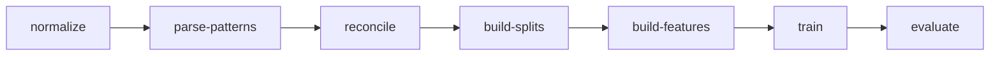

If a stage fails, it retries. If it fails again, it stops and shows you exactly where.

**Cost:** ~$1 per 1,000 activity runs. Effectively free.

### Synapse Serverless SQL — ask questions without a database

**What it is:** run SQL directly against Parquet files in storage. No server, no loading.

```sql
SELECT count(*) FROM OPENROWSET(BULK 'https://.../bronze/**', FORMAT='PARQUET')
```

**Cost:** ~$5 per terabyte scanned. Because we partition by day, most queries touch a
fraction of the data.

### Azure Functions — the scoring endpoint

**What it is:** a small piece of code that wakes when called and sleeps otherwise.

**The honest justification:** in a batch pipeline nothing calls this in anger. Its real
job is to be the **"online" half of the parity test** — the CI check proving the serving
feature path matches the batch one.

Say that plainly. An interviewer will ask "who calls this?" and the honest answer is
better than pretending there's live traffic.

**Cost:** ~$0.

### Terraform — infrastructure as text

**What it is:** you describe what you want in a text file; it builds it. One command up,
one command down.

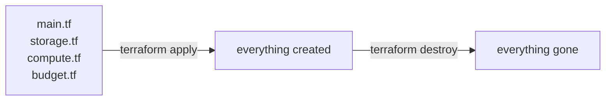

**Why it matters more than convenience:** you must be able to *prove* you got back to $0.
A console click-through can't be proven or repeated. `terraform destroy` can.

### Log Analytics and Budget — the safety rails

**Log Analytics** collects the JSON your pipeline already prints
(`{"event": "...", "rows": ..., "wall_clock_sec": ...}`) and makes it searchable. **Zero
code changes** — this is why the pipeline logs JSON instead of prose.

**Budget** emails you at $40, $80, $150. Free.

---

# Part 5 — What actually happens when we run it

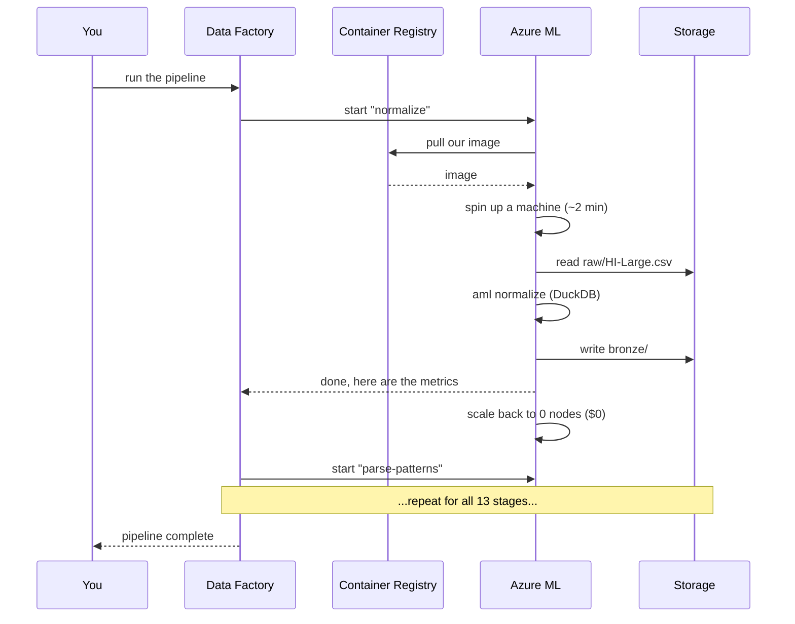

**Notice the last line of each block: the machine shuts down.** Between stages you pay
for storage only.

---

# Part 6 — The money model

The single most important thing to understand about cloud cost:

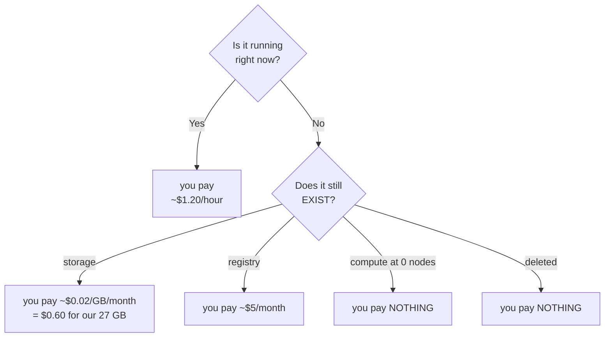

**The two things that could burn the credit while you sleep:**

```
⚠️  a Spark pool with auto-pause disabled       ~$1-3/hour, forever
⚠️  an ML cluster with min_nodes = 1            bills 24/7 even when idle
```

Both are set correctly in the Terraform. Both are worth checking by eye after the first
`apply`, because they're the only two resources here that can bill while idle.

**Expected total: $25–50 of your $200.**

---

# Part 7 — The build order

```mermaid
flowchart TD
    A["YOU: create Azure account<br/>⚠️ starts the 30-day clock"] --> B["YOU: az login,<br/>create service principal"]
    B --> C["ME: write Terraform"]
    C --> D["ME: terraform apply<br/>on an EMPTY setup"]
    D --> E["ME: terraform destroy<br/>PROVE teardown works first"]
    E --> F["ME: terraform apply again"]
    F --> G["ME: build + push Docker image"]
    G --> H["ME: 17 GB into storage<br/>~1-2 hours"]
    H --> I["ME: run the 182M pipeline<br/>2-8 hours ← the unknown"]
    I --> J["ME: DuckDB vs Spark<br/>the crossover"]
    J --> K["ME: README, cut list,<br/>teardown proof"]

    style D fill:#2d4a2d
    style E fill:#4a2d2d
```

**Why destroy is tested before anything is built:** finding out teardown is broken *after*
filling the account with data is a bad day. Prove the exit works while the room is empty.

---

# Part 8 — What we expect to break

Being honest about this up front, because it's the phase's actual content.

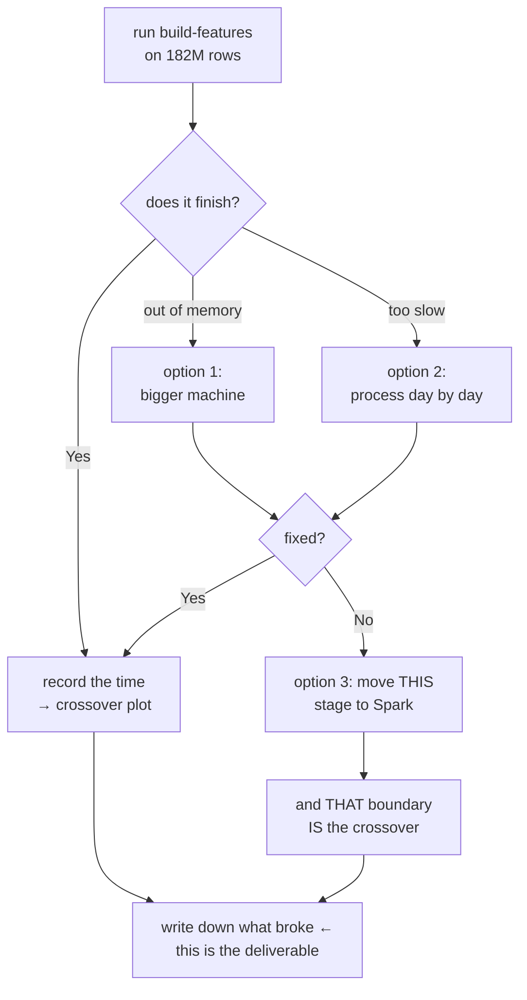

We already know where to look. From your own machine:

```
             5.08M rows    31.9M rows    throughput
normalize       1.4s          8.0s       flat ✅
build_features  6.9s        515.7s       12× WORSE per row ⚠️
```

**Feature building is 12× slower per row at 6× the data.** That's DuckDB running out of
memory and spilling to disk. At 182M rows it may not finish on one machine.

**That's not a failure — it's the finding.** *"What broke at 182 million rows?"* is the
question interviewers most want answered, and it can't be faked.

---

# Part 9 — Teardown

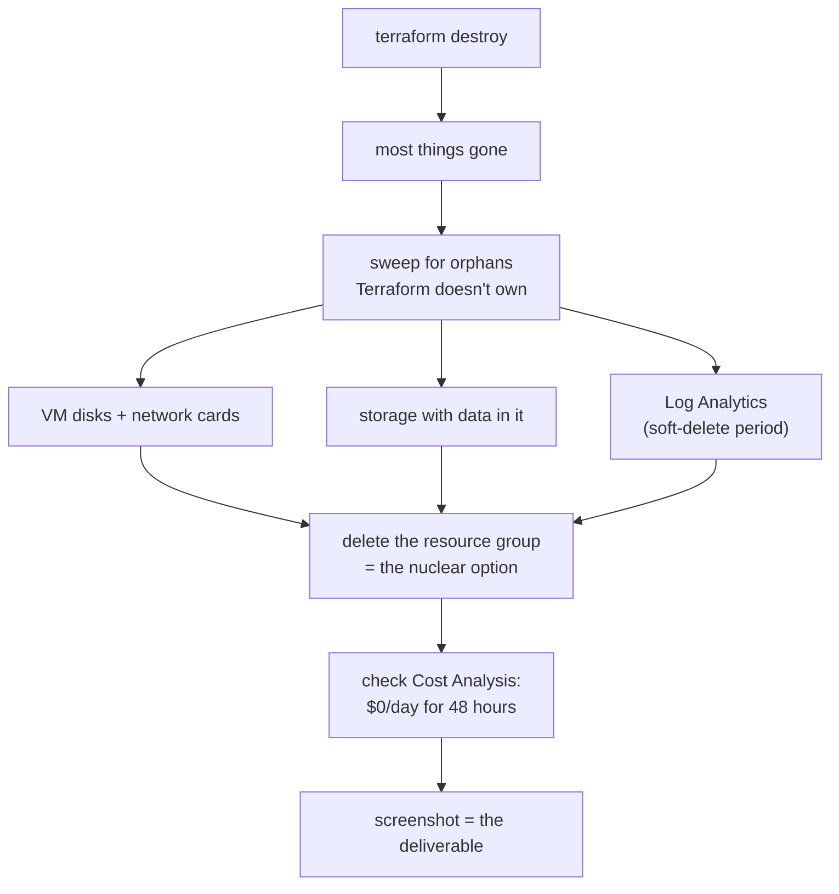

**The emergency stop:** if anything ever looks wrong, delete the resource group. Everything
inside dies with it. Nothing in there is precious — the code, tests and local results are
all on your machine and in git.

---

# Part 10 — The AWS ↔ Azure map

Worth knowing for interviews. It shows you understand the **shapes**, not one vendor's
branding.

| what it does | AWS | Azure |
|---|---|---|
| store files | S3 | ADLS Gen2 |
| SQL over files | Athena | Synapse Serverless SQL |
| run a container, scale to zero | Fargate | Container Apps Jobs |
| training job, scale to zero | SageMaker Training | Azure ML jobs |
| managed Spark | EMR Serverless | Synapse Spark pool |
| run stages in order | Step Functions | Data Factory |
| tiny function | Lambda | Azure Functions |
| store Docker images | ECR | Container Registry |
| logs and metrics | CloudWatch | Log Analytics |
| identity for automation | IAM role | Service principal |

**Every AWS service in your original plan has an Azure equivalent with the same
scale-to-zero property.** That's what made the switch safe.

---

# The summary

```
what changes    Terraform (doesn't exist yet), one Dockerfile, CI auth
what doesn't    all 2,895 lines of pipeline code
                all 96 tests
                every command you already run

what we gain    182 million rows instead of 32 million
                a throughput + cost table at three scales
                the point where one machine stops beating a cluster

what it costs   $25–50 of your $200
```
